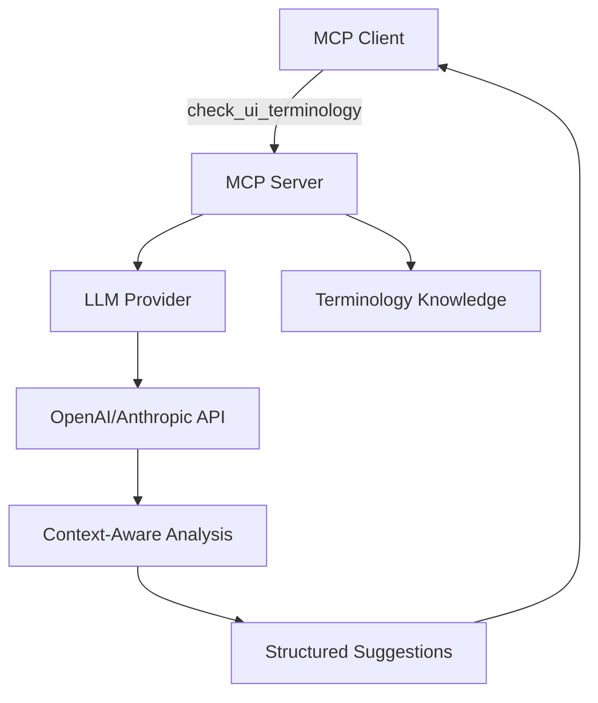

# MCP-UI-Terminology Checker (EN ⇄ JP) with LLM Integration

A **Model Context Protocol (MCP)** server that provides LLM-powered terminology auditing for English and Japanese UI strings, leveraging curated term-banks and AI-driven context analysis.

---

## ✨ Why this project matters
* **Real MCP Implementation** – Connects LLMs to specialized terminology knowledge using the official MCP protocol
* **AI-Powered Analysis** – Goes beyond regex matching with context-aware LLM suggestions  
* **Consistency saves money** – fixing terminology bugs late in QA burns engineering hours and frustrates users
* **Bilingual expertise** – Japanese ↔ English UI copy challenges solved with cultural context awareness

---

## 🖼️ How it works (v2.0 - LLM Integrated)

| Step | Flow |
|------|------|
| 1 | **MCP Client** connects to server and discovers available tools |
| 2 | Client calls **`check_ui_terminology`** tool with UI text + context |
| 3 | Server analyzes text using **OpenAI/Anthropic LLM** + terminology knowledge |
| 4 | LLM provides **context-aware suggestions** with explanations |
| 5 | Client receives structured response with actionable improvements |



---

## ⚙️ Quick start – 5 minutes

```bash
# 1 – Clone and setup
git clone https://github.com/<your-handle>/mcp-ui-terminology.git
cd mcp-ui-terminology

# 2 – Configure LLM
cp env_template.txt .env
# Edit .env and add your OpenAI or Anthropic API key

# 3 – Install dependencies  
pip install -r requirements.txt

# 4 – Test LLM integration
python test_quick.py

# 5 – Launch MCP server
docker compose up --build -d
```

### Test with real LLM analysis:

```bash
curl -H "Authorization: Bearer TEST_TOKEN" \
     -H "Content-Type: application/json" \
     -X POST http://localhost:8000/context-request \
     -d '{"text":"Please login to access your e-mail account","lang":"en","context":"Login page"}'
```

Expected response (with LLM):
```json
{
  "issues": [
    {
      "type": "preferred_synonym",
      "original": "login",
      "suggestion": "sign in",
      "reason": "Platform standards prefer 'sign in' for user authentication",
      "start": 7,
      "end": 12,
      "severity": "warning"
    },
    {
      "type": "consistency",
      "original": "e-mail", 
      "suggestion": "email",
      "reason": "Modern UI conventions use 'email' without hyphen",
      "start": 28,
      "end": 34,
      "severity": "info"
    }
  ],
  "llm_used": true,
  "provider": "openai"
}
```

---

## 🗂️ Repository layout

```
app/                # FastAPI MCP server
 ├─ api/            # API endpoints  
 ├─ core/
 │  ├─ config.py   # LLM + server configuration
 │  └─ terminology.py # LLM-powered analysis engine
 └─ main.py         # MCP-compatible FastAPI app

data/
 ├─ terms.db        # Terminology knowledge base
 └─ .gitkeep

tests/              # PyTest suites

env_template.txt    # Configuration template
requirements.txt    # Dependencies (includes openai, anthropic)
test_quick.py      # LLM integration test
```

---

## 🤖 LLM Integration Features

### **Context-Aware Analysis**
- Understands where text appears (button, error message, etc.)
- Considers cultural context for Japanese localization
- Provides reasoning for each suggestion

### **Multi-Provider Support**
- **OpenAI**: GPT-3.5-turbo, GPT-4
- **Anthropic**: Claude-3-Haiku, Claude-3-Sonnet
- Automatic fallback to rule-based checking

### **MCP Tool Integration**
- `check_ui_terminology` - Main analysis tool
- `get_terminology_rules` - Retrieve language guidelines  
- Full MCP protocol compatibility

---

## 🔭 Roadmap

| Sprint | Status | Milestone |
| ------ | ------ | --------- |
| 1 | ✅ **Complete** | MCP server + LLM integration |
| 2 | 🚧 **Current** | Web frontend for easy demo |
| 3 | 📋 **Planned** | Browser extension |
| 4 | 📋 **Planned** | Slack/Discord bot integration |
| 5 | 🌟 **Future** | Custom terminology training |

---

## 🛠️ Tech stack

* **FastAPI + MCP Protocol** – Standards-compliant server
* **OpenAI + Anthropic APIs** – LLM-powered analysis  
* **SQLite + SQLAlchemy** – Terminology knowledge base
* **Docker Compose** – One-command deployment
* **PyTest + GitHub Actions** – CI/CD

---

## 📄 Licence

MIT – free for personal or commercial use.

---

## 🙏 Credits

* **Model Context Protocol** - Anthropic
* **Microsoft Terminology Collection** (TBX)
* **Apple Localisation Glossary**  
* **JTF Japanese Style Guide**

```
```
